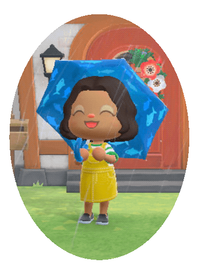

  
<h4>Hi there & welcome!</h4>
<text style="font-size:14px">I'm a software engineer, reader, gamer, lover of learning.  Check out some of my projects below & let me know if you have any questions!</text>

<h4>Contact</h4>

<h4>Technologies & Tools</h4>

 
